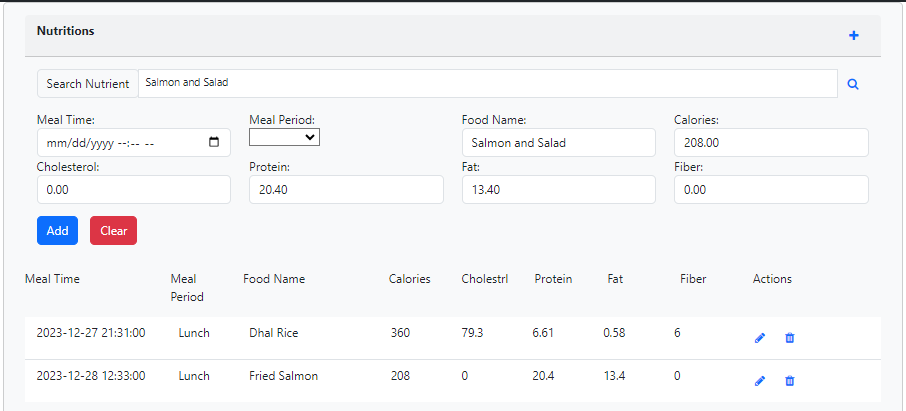

# Health Tracker Application

## Overview
> Health tracker application is built using Vue2.x with Bootstrap-vue on top of Health Tracker API Application
> 
## Project setup
```
npm install
```

### Compiles and hot-reloads for development
```
npm run serve
```

### Compiles and minifies for production
```
npm run build
```

### Lints and fixes files
```
npm run lint
```

## Application Details

### Sign On
> Application load with sign-on page, requesting users to login with their email-id(user name) and password.
> At this point all the other pages are protected.
>


### Sign Up
> If its a new user, they won't be able to login. And there are errors handled to inform the user that they did not
> subscribe to application yet.
> 
> So user can click Sign Up to create a new account.


### Home Page
> Once user successfully create an account in the application. They can now login.
> And once they login, they will be able to see all protected pages which includes
> + Home Page
> + Activities Page
> + Measurements Page
> + Nutritions Page
> + Profile Page
> + Logout
> + UnSubscribe


> This page provides a overview of users progress in various health categories.
> On the top it also provide recommended idle callories which is calculate by a formula taken from Chat GPT. 
> 

### Activities Page
> Activities page provides user possibilities to track their activities such as running, swimming, walking, cycling, etc.
> They can enter activity date, activity and calories burned to track their progress over the time.


### Measurement Page
> Measurements page provides user possibilities to track their body measurements such as weight, chest, hip, bicep, etc.
> They can enter measurement date, and all measurements to track their progress over the time.


### Nutrition Page
> Nutrition is something everyone would like to track and make sure they are staying within their calorie limits.
> Nutrition page helps in easily finding micros and macros and any food that user consume. And help them easily add into 
> tracker. This is made easy by using an external service.


> Once user search for any food name, this is how they information back
> 


### Logout
> User can click 3 bars in the top right corner and logout the application.
>
### UnSubscribe
> User can click 3 bars in the top right corner and UnSubscribe the application. And this will delete the user and their activities.


##Conclusion
> This concludes the functionality of Health Tracker application.
